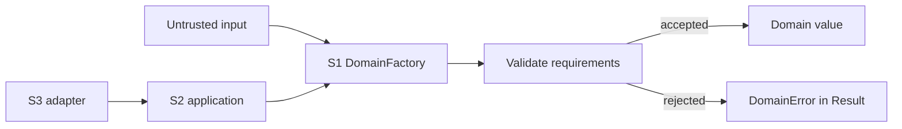

# Construction authority

Construction authority means that consumer-domain values are created through one explicit boundary rather than through scattered constructors and ad hoc factories. Centralizing creation makes invariant checks discoverable, testable, and reviewable. It does not turn the boundary into a service locator or application workflow engine.

## The boundary

A construction boundary belongs in S1 consumer-domain code. It accepts input, checks domain requirements, and returns a `Result<T>`. Constructors can remain private or internal where the consuming design permits it.

```csharp
using Dx.Domain;
using Dx.Domain.Errors;

public sealed class CustomerNumber
{
    internal CustomerNumber(string value) => Value = value;
    public string Value { get; }
}

public static class DomainFactory
{
    public static Result<CustomerNumber> CreateCustomerNumber(string text)
    {
        if (string.IsNullOrWhiteSpace(text))
        {
            return Dx.Result.Failure<CustomerNumber>(
                DomainError.Create("customer.number.required", "Customer number is required."));
        }

        return Dx.Result.Success(new CustomerNumber(text.Trim()));
    }
}
```

Configure the facade root so analyzers can classify the boundary:

```ini
[*.cs]
dx.scope.map = S0:Dx.Domain;S1:MyApp.Domain;S2:MyApp.Application;S3:MyApp.Infrastructure
dx.facade.root = MyApp.Domain.DomainFactory
```



## Analyzer coverage

DXA010 detects supported direct-construction patterns outside authority. DXA011 detects exposed public factories on classified consumer-domain types. DXA080 checks configured facade factories for recognized invariant enforcement. The rules do not comprehensively cover reflection, serializer materialization, dynamic invocation, or delegated factory chains.

S0 substrate types are different: `Result`, `DomainError`, identities, facts, and causation are the building blocks used by domain factories. They remain publicly usable according to the package API. Construction authority constrains S1 to S3 consumer code, not the substrate itself.

See the [construction-boundary guide](../../use/guides/build-a-construction-boundary.md) and [ADR-0003](../decisions/adr-0003-dxa010-warning.md).
