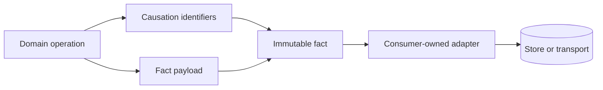

# Facts and causation

`Dx.Domain.Facts` supplies immutable structural records for describing something that occurred and the identifiers that connect it to an originating operation. It is deliberately not a message bus, event store, aggregate framework, or publication policy.

## Structural responsibility

A fact contains an identity, a fact-type identifier, a payload, causation metadata, and a UTC timestamp. `Causation` associates the fact with correlation, trace, span, actor, and user identities exposed by the package API. The structures preserve explicit provenance fields; they do not decide retention, ordering, delivery, serialization, or authorization.

```csharp
var causation = Causation.Create(
    correlationId,
    traceId,
    spanId,
    actorId,
    userId);

var fact = Fact<OrderAccepted>.Create(
    "order.accepted",
    new OrderAccepted(orderId),
    causation,
    utcTimestamp);
```

Use the signatures compiled by the installed package as authoritative if a prerelease API differs from this conceptual shape.



## Keep policy at the edge

The domain operation may produce a structural fact. An application or infrastructure adapter decides whether to publish or persist it. This preserves a small substrate and avoids coupling domain types to a broker, database, serializer, retry policy, or transaction model.

A string fact type is acceptable only as a centralized, validated semantic identifier. Ad hoc string-driven branching conflicts with the project manifesto. Consumers should define stable identifiers and test their mapping at the adapter boundary.

## Guarantee boundary

Immutability prevents ordinary property mutation after creation. It does not prove that the payload is semantically correct, that timestamps from external systems are trustworthy, or that correlation identifiers are used appropriately. Reflection, serializers, and default struct values remain relevant limits. See [architecture](../architecture.md), [non-goals](../non-goals.md), and [limitations](../../use/limitations.md).
