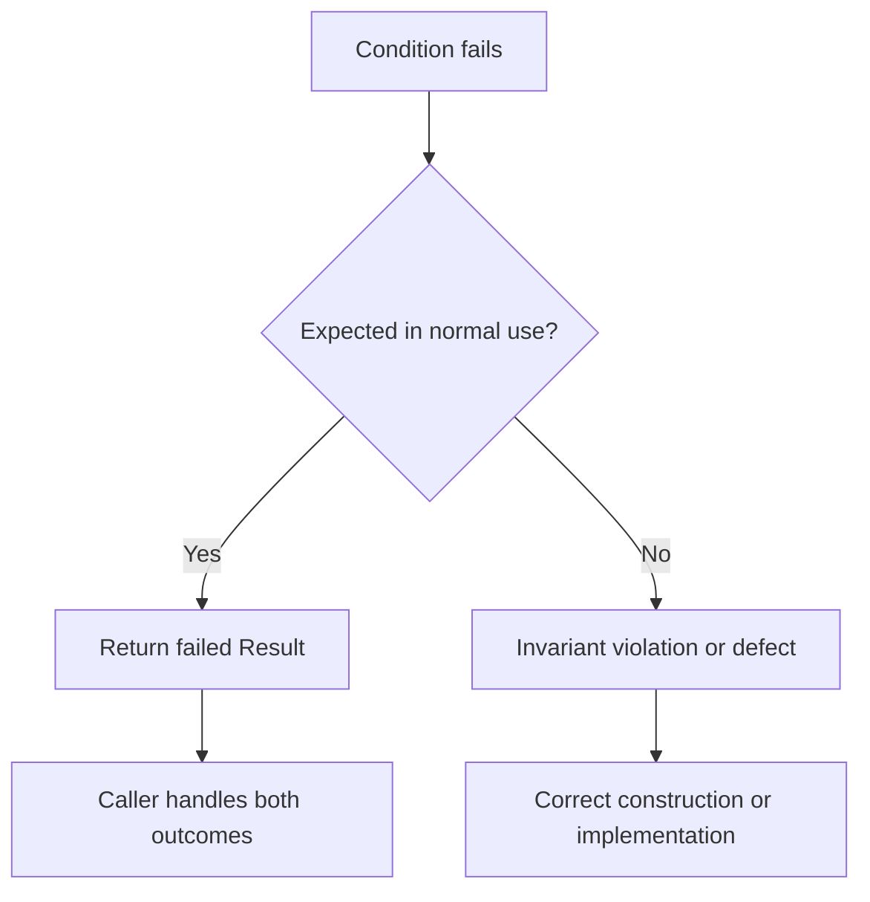

# Invariants and recoverable requirements

An invariant describes a condition that must hold for a valid state. A recoverable requirement describes an expected rejection that the caller can handle. Dx.Domain keeps these categories separate because they imply different control flow and different evidence.

## Choose the failure model

Use `Invariant.That` when a false condition exposes an invalid program state or a broken internal construction path. Use a `Result<T>` failure when input can be rejected during normal operation. The distinction is not “important versus unimportant.” It is whether the caller is expected to continue by selecting another valid path.

```csharp
static Result<EmailAddress> CreateEmail(string text)
{
    if (string.IsNullOrWhiteSpace(text))
    {
        return Dx.Result.Failure<EmailAddress>(
            DomainError.Create("email.required", "Email is required."));
    }

    return Dx.Result.Success(new EmailAddress(text));
}
```

A domain factory should validate before it creates the value and return the rejected condition as data. An internal invariant check instead guards an assumption that should already have been established.



## What runtime checks prove

A runtime check proves only that the executed path evaluated the condition. It does not prove that every construction path contains the check, that the predicate is complete, or that reflection and serializers cannot create a default value. DXA080 recognizes the presence of supported invariant enforcement in configured facade methods, but presence is not semantic proof.

## Keep invariants close to authority

Place validation at the smallest construction boundary that owns the rule. Do not repeat the same rule in controllers, persistence adapters, and UI handlers. Edge layers may validate transport shape, but the domain boundary owns domain validity. Tests should cover accepted values, rejected values, default struct behavior where relevant, and the public factory through which consumers create the type.

See [construction authority](construction-authority.md), [DXA080](../../reference/diagnostics/DXA080.md), and [limitations](../../use/limitations.md).
