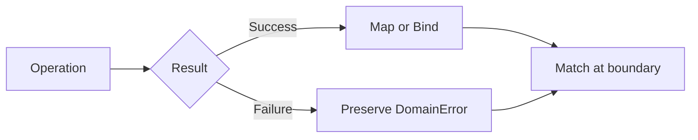

# Results and errors

`Result<T>` represents one of two explicit outcomes: a value or a `DomainError`. It is the normal return type for expected domain failure, such as malformed input or a rejected business operation. Unexpected programming faults remain exceptions. This separation prevents expected failure from being hidden in control flow while preserving exceptions for defects and unavailable infrastructure.

## Create a result

Use the public `Dx.Result` facade. A success carries a non-null value. A failure carries a structured error with a stable code and a human-readable message.

```csharp
using Dx.Domain;
using Dx.Domain.Errors;
using Dx.Domain.Primitives;

static Result<UserId> ParseUserId(string text)
{
    if (UserId.TryParse(text, null, out var id))
        return Dx.Result.Success(id);

    return Dx.Result.Failure<UserId>(
        DomainError.Create("user.id.invalid", "Expected a non-empty GUID."));
}
```

## Transform and finish explicitly

`Map` changes a successful value without changing the failure. `Bind` chains another operation that can fail. `Match` leaves the result world by handling both alternatives.

```csharp
Result<string> label = ParseUserId(input)
    .Map(id => $"user:{id}");

Result<Account> account = ParseUserId(input)
    .Bind(id => LoadAccount(id));

string response = account.Match(
    value => value.DisplayName,
    error => $"error:{error.Code}");
```



## Enforcement boundary

The C# type system preserves the result shape. DXA020 detects directly ignored results, DXA022 identifies common exception-based domain control flow, and DXA030 checks recognized handling patterns. These rules are local and structural. Assigning a result does not prove that later behavior is correct, and a suppression remains technically possible.

Use `Result<T>` when callers can reasonably act on failure. Do not convert defects, cancellation, or unavailable infrastructure into arbitrary domain errors merely to avoid exceptions. See [limitations](../../use/limitations.md) and the [diagnostic reference](../../reference/diagnostics/index.md).
