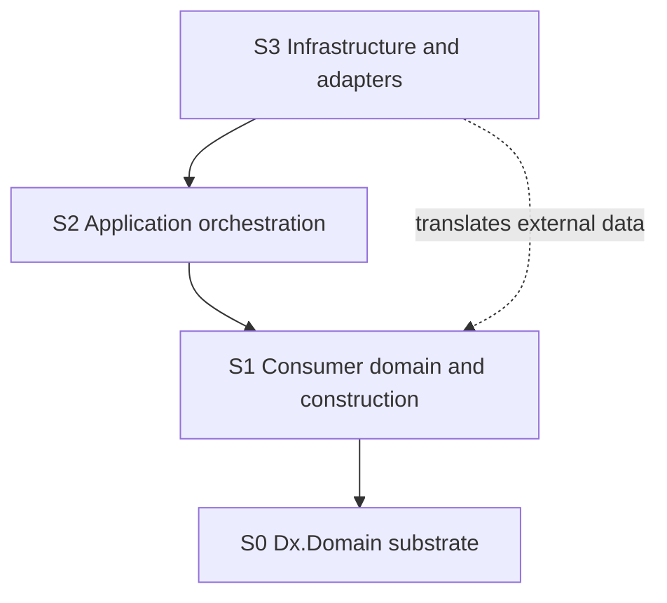

# Scopes and roles

Scopes let analyzers apply architectural rules according to where code participates in the system. They are classification facts, not runtime sandboxes. A scope mapping tells an analyzer how to interpret an assembly or namespace; it does not prevent references, loading, reflection, or execution.

## S0 to S3

- **S0, substrate:** Dx.Domain packages that provide results, errors, identities, facts, annotations, and analyzer support.
- **S1, domain:** consumer-owned domain types, invariant definitions, and approved construction boundaries.
- **S2, application:** orchestration that invokes domain behavior and coordinates use cases.
- **S3, infrastructure:** persistence, transport, serialization, clocks, and external adapters.



Dependencies normally point downward. A higher scope can use lower-level contracts, while the substrate does not acquire application or infrastructure vocabulary. “Normally” is intentional: scope classification guides specific analyzer rules and does not itself implement a complete dependency analyzer.

## Configure classification

```ini
[*.cs]
dx.scope.map = S0:Dx.Domain;S1:MyApp.Domain;S2:MyApp.Application;S3:MyApp.Infrastructure
dx.facade.root = MyApp.Domain.DomainFactory
```

Use exact assembly prefixes and keep the mapping in the consuming repository. After changing configuration, build a small positive and negative fixture to confirm the effective classification. A misspelled or overly broad mapping can change which diagnostics appear.

## Why rules differ by scope

S0 deliberately exposes substrate factories needed by consumers. S1 owns domain construction. S2 may coordinate results but should not become a second construction authority. S3 translates external representations and may contain framework-specific behavior that would be inappropriate in the kernel.

The strongest statement available is local: when an analyzer recognizes a configured scope and a supported syntax or symbol pattern, it reports the corresponding rule. Classification does not prove semantic correctness or cross-assembly transitivity. See [configuration](../../reference/configuration.md), [enforcement model](../enforcement-model.md), and [limitations](../../use/limitations.md).
